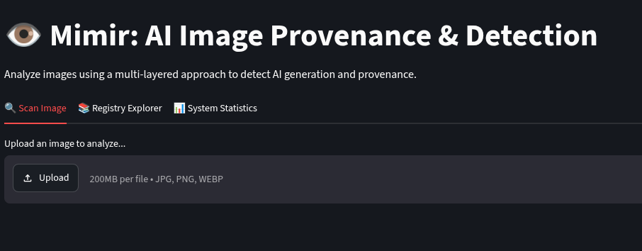
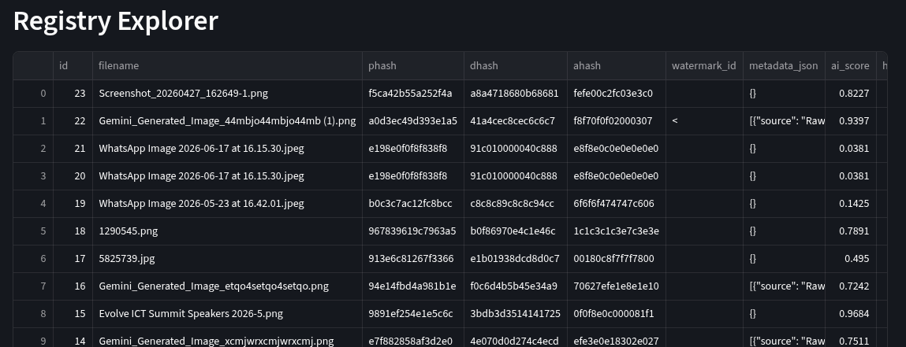
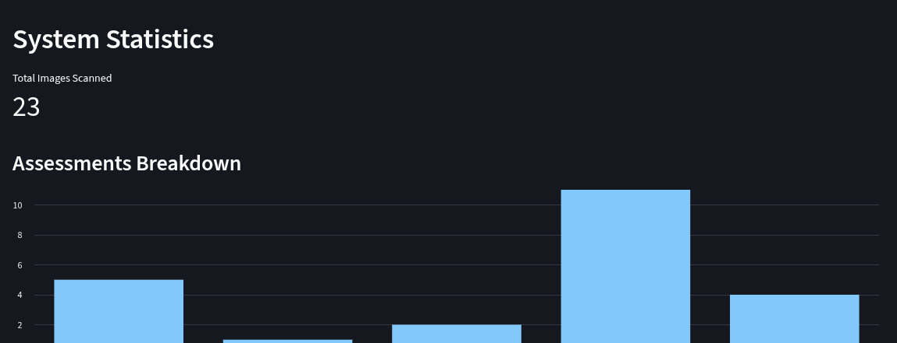
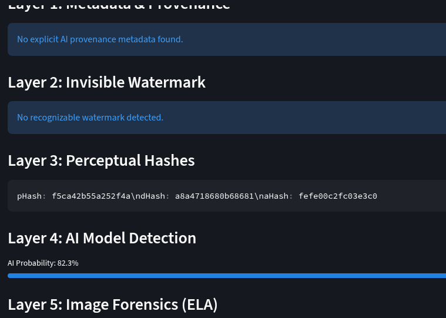

# Mimir: AI Image Provenance & Detection

> *"I'm the smartest man alive!"* — [Mimir](https://hero.fandom.com/wiki/Mimir_(God_of_War)), *God of War* (2018)

## Why Mimir?

In Norse mythology, Mimir is the keeper of wisdom and hidden knowledge. In *God of War*, he serves as a trusted guide who helps uncover truths that are not immediately visible.

As AI-generated images become increasingly realistic, seeing is no longer enough to determine what is real. Images can be created, manipulated, and shared at scale, often without any reliable way to verify their authenticity.

Inspired by its namesake, **Mimir** helps uncover the hidden story behind an image. It analyzes signals that are invisible to the human eye—such as metadata, watermarks, image fingerprints, AI-generated artifacts, and forensic indicators—to assess whether an image is authentic, manipulated, or AI-generated.

Mimir is a production-quality Python application that combines provenance analysis, invisible watermark detection, perceptual hashing, AI-based classification, and digital image forensics into a unified multi-layer verification pipeline.

Its mission is simple:

**Help people make informed decisions by revealing the evidence hidden beneath the image.**

## Features

- **Layer 1: Metadata & Provenance** (EXIF, XMP, C2PA extraction)
- **Layer 2: Invisible Watermark** (DWT/DCT decoding)
- **Layer 3: Perceptual Hashing** (pHash, dHash, aHash)
- **Layer 4: AI Model Detection** (ViT/CNN integration support)
- **Layer 5: Image Forensics** (Error Level Analysis)
- **SQLite Registry**: Local storage of fingerprints and detection history.
- **Streamlit Dashboard**: Professional UI for journalists and researchers.
- **FastAPI**: REST API for integration into bots and other applications.

## Architecture

```
Mimir/
├── app.py              # Streamlit dashboard
├── api.py              # FastAPI application
├── requirements.txt
├── README.md
├── core/               # Core scoring and config logic
├── detectors/          # Modular detection layers (metadata, hashing, watermark, AI)
├── forensics/          # Image forensics (ELA, noise analysis)
├── registry/           # SQLite local registry
└── tests/              # Unit tests
```

## Installation

```bash
# Clone the repository and navigate into it
cd Mimir

# Create a virtual environment
python -m venv mimir
source mimir/bin/activate  # On Windows use `mimir\Scripts\activate`

# Activate the venv

```source mimir/bin/activate
```

# Install dependencies
```
pip install -r requirements.txt
```

## Usage

### Streamlit Dashboard
Launch the visual user interface:
```bash
streamlit run app.py
```

#### Dashboard Walkthrough



Once the dashboard is running, you will navigate through three main tabs designed to separate the workflow logically:

1. **🔍 Scan Image**
   - **Usage**: Upload an image and click "Run Full Scan" to process it through Mimir's 5-layer detection pipeline. Results for metadata, watermarks, hashes, AI probability, and forensics are displayed instantly.
   - **Help Mimir Learn**: At the bottom of the results, a feedback section allows you to verify the prediction. This powers a real-time Reinforcement Learning loop to update the system's scoring weights.
   - **Why it exists**: It serves as the primary operational interface, providing immediate, transparent, and layer-by-layer forensic evidence to the user.

2. **📚 Registry Explorer**

   - **Usage**: Displays a tabular database of all previously scanned images, their resulting hashes, AI probabilities, and final assessments.
   - **Why it exists**: Acts as a persistent historical ledger. It is crucial for provenance tracking, auditing, and referencing past scans without needing to re-upload the original media.

3. **📊 System Statistics**

   - **Usage**: Provides a high-level, macro overview of Mimir's usage, showing the total number of images scanned and a distribution chart of the final assessments.
   - **Why it exists**: Gives administrators and researchers quick insights into system throughput and the overarching trends of the media being analyzed.


### Understanding the Scores


When Mimir checks an image, it gives you two main numbers to explain its final decision:

- **AI Probability**: A score from `0.0` (Real Photo) to `1.0` (AI-Generated). Mimir combines all its checks (hidden watermarks, file data, and pixel patterns) to calculate this. It also learns from your feedback over time. If Mimir finds a hard proof like an AI watermark, it automatically sets the score to `0.95`.
- **Confidence**: This tells you how sure Mimir is. If the AI Probability is right in the middle (`0.5`), Mimir is totally unsure (`0%` confidence). If the AI score is very close to `0.0` or `1.0`, Mimir is very confident (`100%` confidence).

**What the Results Mean**
Mimir uses the AI Probability score to pick one of these final labels:

| Score Range | Final Label | What it Means |
| :--- | :--- | :--- |
| **0.95 or higher** | `Verified Provenance/Watermark Match (AI)` | We found proof (like a hidden watermark) that it was made by AI. |
| **0.86 to 0.94** | `Likely AI Generated` | Very strong signs show it is probably AI. |
| **0.61 to 0.85** | `Possible AI Generated` | Some signs suggest it might be AI, but we aren't totally sure. |
| **0.40 to 0.60** | `Inconclusive` | The system can't tell. The clues are mixed or missing. |
| **0.15 to 0.39** | `Possible Human Created` | It looks mostly like a real photo, but has a few odd spots. |
| **Less than 0.15** | `Likely Human Created` | Strong signs show it is almost certainly a real photograph. |

### FastAPI & Bot Integrations
If you want to connect Mimir to other apps (like Discord, Telegram, or Slack bots), you can run it as an API:
```bash
python api.py
# API docs available at http://localhost:8000/docs
```
**How to Integrate:**
Once the API is running, your bot can send images to Mimir using a simple `POST` request to the `/scan` endpoint. Mimir will analyze the image and return a JSON response containing the `ai_probability`, `confidence`, and the `assessment` label. 

For example, in a Discord bot, when a user uploads an image in chat, your bot can automatically forward that image file to `http://localhost:8000/scan`. Mimir will do the hard work and send back the results. Your bot can then read Mimir's JSON response and reply to the user with a message like: *"Mimir says this image is Likely AI Generated (92% probability)."*

## How the Detection Methods Work
Mimir doesn't just guess; it acts like a digital detective looking for five different types of clues:

1. **File Data (Metadata & EXIF Tags)**: Just like a digital camera saves the date and location of a photo, AI tools often save invisible tags inside the file that say things like "Made by Midjourney" or "Generated by OpenAI." Mimir checks the file to see if any of these tags were left behind.
2. **Hidden Watermarks**: Some AI generators hide secret, invisible patterns inside the picture itself. You can't see them with your eyes, but Mimir uses special math to reveal and read these hidden watermarks.
3. **Digital Fingerprints (Hashes)**: Mimir creates a unique "fingerprint" for every image it checks. If someone downloads an AI image, resizes or re-compresses it, and re-uploads it, Mimir can match the fingerprint to remember that it has seen this AI image before. (Note: These global hashes are robust to format changes but not to cropping).
4. **Visual AI Detection**: Mimir uses a trained computer brain to look really closely at the pixels. It searches for weird patterns that real cameras don't make, but AI generators often mess up on (like strangely blended colors, impossible lighting, or weird textures).
5. **Image Forensics (Error Level Analysis)**: Real photos usually have a consistent, natural level of digital "noise." AI images, because they are generated from scratch, often have parts that don't match up naturally. Mimir highlights these uneven spots to find areas that look stitched together or unnatural.

## Limitations & Future Improvements

While Mimir uses multiple layers of detection to catch AI-generated images, the technology behind AI generation is constantly evolving. Here are the current limitations of the system:

1. **The Fragility of Metadata (EXIF/C2PA)** 
   Metadata is the easiest way to prove an image is AI-generated, but it is also the first thing to disappear. Almost all major social media platforms (Facebook, Instagram, X/Twitter, WhatsApp) automatically compress images and strip away all metadata to save server space and protect user privacy. If a user downloads an AI image from these platforms and scans it with Mimir, the metadata layer will find nothing, because the original file data has been permanently destroyed.

2. **Visual Model Limitations & Bias**
   Mimir currently uses a lightweight, fast computer vision model to analyze pixel patterns. Because this model is relatively small, it is optimized for speed rather than absolute perfection. It can occasionally suffer from "false positives" (flagging heavily edited or heavily filtered real human photos as AI) or "false negatives" (failing to detect cutting-edge, ultra-realistic AI generation, like Midjourney v6). Upgrading to a massive, specialized model (like a fine-tuned Vision Transformer) would improve this, but would require much heavier computing power.

3. **Proprietary and Secret Watermarks**
   Mimir is equipped to detect standard, open-source invisible watermarks. However, tech giants are developing their own secret, proprietary watermarking systems (for example, Google's SynthID or OpenAI's internal watermarking). Because the exact mathematical keys to unlock and read these watermarks are kept strictly confidential by those companies, Mimir cannot detect them without official API access.

**Future Improvements**
- **Bot Integrations**: Releasing pre-configured Discord and Telegram bots so communities can scan images directly in chat without opening the dashboard.
- **Video & Audio Expansion**: Adding forensic tools to scan deepfake videos and AI-generated voice cloning.
- **Deep-Learning Forensics**: Enhancing the Error Level Analysis (ELA) with modern neural networks to better identify microscopic tampering.

## Why This Matters

The challenge of AI-generated media is not simply detecting what is fake. It is preserving trust in what we see, share, and believe.

As synthetic media becomes more realistic and more accessible, verification must become just as accessible. Most people will never use a forensic toolkit or visit a fact-checking website before forwarding an image. Verification needs to exist where information is consumed and shared.

Mimir was built with that goal in mind: bringing powerful image provenance and forensic analysis out of specialist environments and into tools that ordinary people can use.

Whether it's a journalist verifying a breaking news image, a researcher investigating digital manipulation, or a grandmother in Mutoko trying to determine whether a viral image is real before sharing it with family, everyone deserves access to trustworthy verification tools.

The future of media trust should not belong only to experts.

Seeing is no longer believing!!!